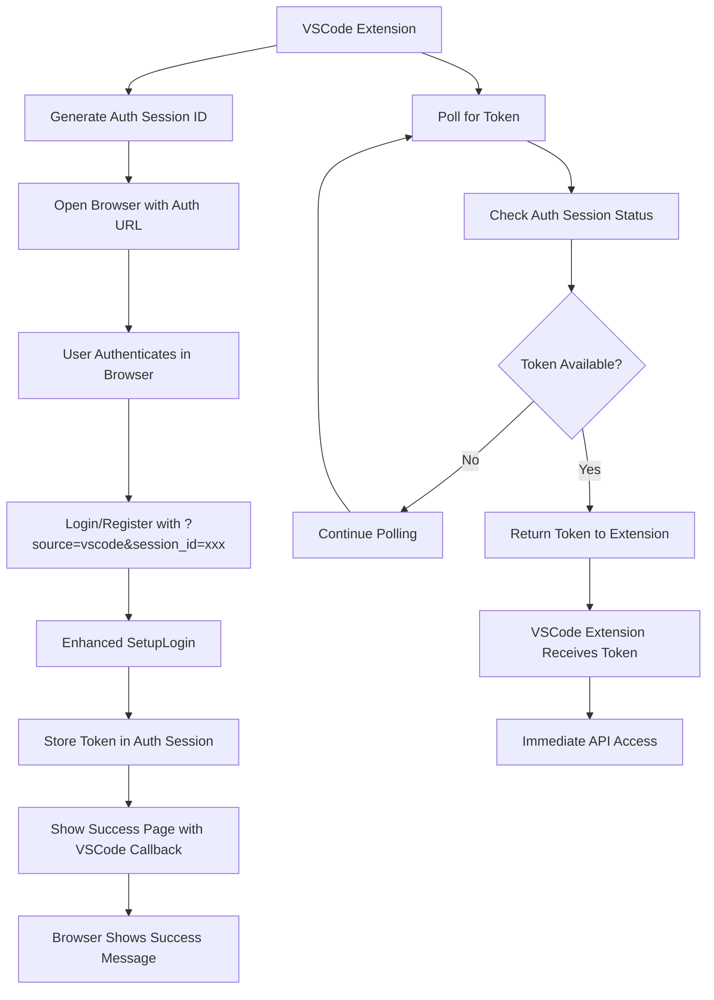
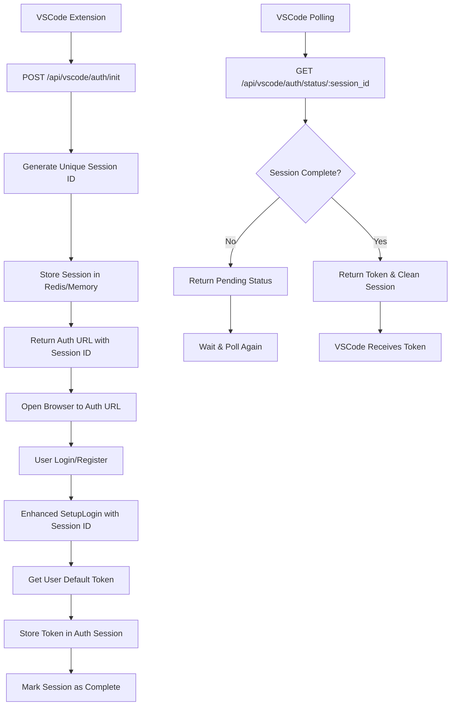

# VSCode Integration Architecture
## Browser-Based Authentication with Callback/Polling for One-API

### Executive Summary

This architecture document outlines the design for enhancing the existing one-api system to provide seamless VSCode integration through a browser-based authentication flow. The VSCode extension opens a web browser for user authentication, then retrieves the API token through a secure callback/polling mechanism, enabling immediate API access without exposing credentials directly to the extension.

---

## Current System Analysis

### ✅ Existing VSCode Support Infrastructure

The system already has robust foundation for VSCode integration:

1. **Source Parameter Validation**
   - Both `/api/user/login` and `/api/user/register` accept `?source=vscode`
   - Secure validation against whitelist: `["vscode", "web", "mobile", "api"]`
   - Injection attack protection through parameter validation

2. **Token Management System**
   - Automatic default API token creation on user registration
   - System access tokens for management operations
   - Comprehensive token lifecycle management
   - User API tokens with quota and permission controls

3. **Authentication Flow**
   - `SetupLogin()` function handles session and response setup
   - Existing VSCode-specific logging and tracking
   - Route alias `/api/user/sign_up` for compatibility

4. **Security Framework**
   - Password hashing and validation
   - Session management with Gin sessions
   - Token-based authentication system
   - User status and role-based access control

---

## Architecture Design

### 1. System Flow Diagrams

#### VSCode Browser-Based Authentication Flow



#### Authentication Session Management



### 2. Enhanced API Specifications

#### New VSCode Authentication Endpoints

##### Initialize Authentication Session
**Endpoint:** `POST /api/vscode/auth/init`

**Request:**
```json
{
  "client_name": "VSCode Extension",
  "version": "1.0.0"
}
```

**Response:**
```json
{
  "success": true,
  "data": {
    "session_id": "vscode_auth_1234567890abcdef",
    "auth_url": "http://localhost:3000/login?source=vscode&session_id=vscode_auth_1234567890abcdef",
    "expires_in": 600,
    "polling_interval": 2
  }
}
```

##### Poll Authentication Status
**Endpoint:** `GET /api/vscode/auth/status/:session_id`

**Response (Pending):**
```json
{
  "success": true,
  "data": {
    "status": "pending",
    "message": "Waiting for user authentication"
  }
}
```

**Response (Completed):**
```json
{
  "success": true,
  "data": {
    "status": "completed",
    "api_token": "sk-1234567890abcdef...",
    "token_name": "VSCode Integration",
    "user": {
      "id": 1,
      "username": "user123",
      "display_name": "User 123"
    }
  }
}
```

**Response (Expired):**
```json
{
  "success": false,
  "message": "Authentication session expired",
  "error": "session_expired"
}
```

#### Enhanced Login/Register Flow

##### Enhanced Login with Session ID
**Endpoint:** `POST /api/user/login?source=vscode&session_id=xxx`

**Current Flow Enhancement:**
1. Normal authentication process
2. If session_id provided and source=vscode:
   - Get or create user's default API token
   - Store token in authentication session
   - Mark session as completed
   - Show VSCode success page instead of redirecting to /token

##### Enhanced Register with Session ID
**Endpoint:** `POST /api/user/register?source=vscode&session_id=xxx`

**Current Flow Enhancement:**
1. Normal registration process
2. If session_id provided and source=vscode:
   - User's default token is already created during registration
   - Store token in authentication session
   - Mark session as completed
   - Show VSCode success page

### 3. Data Models

#### VSCode Authentication Session
```go
type VSCodeAuthSession struct {
    ID          string    `json:"id" redis:"id"`
    Status      string    `json:"status" redis:"status"` // pending, completed, expired
    APIToken    string    `json:"api_token,omitempty" redis:"api_token"`
    TokenName   string    `json:"token_name,omitempty" redis:"token_name"`
    UserID      int       `json:"user_id,omitempty" redis:"user_id"`
    Username    string    `json:"username,omitempty" redis:"username"`
    DisplayName string    `json:"display_name,omitempty" redis:"display_name"`
    ClientName  string    `json:"client_name" redis:"client_name"`
    Version     string    `json:"version" redis:"version"`
    CreatedTime int64     `json:"created_time" redis:"created_time"`
    ExpiresAt   int64     `json:"expires_at" redis:"expires_at"`
}
```

### 4. Security Model

#### Session Security
1. **Session ID Generation**
   - Use cryptographically secure random generation
   - Format: `vscode_auth_` + 32 character hex string
   - Unique across all active sessions

2. **Session Storage**
   - Store in Redis (preferred) or in-memory cache
   - TTL of 10 minutes (600 seconds)
   - Automatic cleanup of expired sessions

3. **Token Security**
   - Only return token once per session
   - Clear token from session after retrieval
   - Use existing token validation and permissions

4. **Rate Limiting**
   - Limit authentication session creation per IP
   - Limit polling frequency per session
   - Standard rate limiting on all endpoints

#### Authentication Flow Security
1. **Source Validation**
   - Maintain existing source parameter validation
   - Ensure session_id is only processed for vscode source

2. **Session Validation**
   - Validate session exists and is not expired
   - Ensure session is in pending state before completion
   - Clean up session after token retrieval

### 5. Frontend Modifications

#### New VSCode Success Page
**Path:** `/vscode/auth/success`

```html
<!DOCTYPE html>
<html>
<head>
    <title>VSCode Authentication Successful</title>
    <style>
        body { 
            font-family: Arial, sans-serif; 
            text-align: center; 
            padding: 50px;
            background-color: #1e1e1e;
            color: #ffffff;
        }
        .success-icon { font-size: 48px; color: #00ff00; }
        .message { font-size: 18px; margin: 20px 0; }
        .sub-message { font-size: 14px; color: #cccccc; }
    </style>
</head>
<body>
    <div class="success-icon">✓</div>
    <div class="message">VSCode Authentication Successful!</div>
    <div class="sub-message">You can now close this browser tab and return to VSCode.</div>
    <div class="sub-message">Your API token has been securely transferred to the VSCode extension.</div>
</body>
</html>
```

#### Enhanced Login/Register Forms
- Add hidden session_id field when source=vscode
- Modify success handling to show VSCode success page
- Add VSCode-specific messaging

### 6. Implementation Details

#### Controller Modifications

##### New VSCode Authentication Controller
**File:** `controller/vscode_auth.go`

```go
package controller

import (
    "crypto/rand"
    "encoding/hex"
    "fmt"
    "net/http"
    "time"

    "github.com/gin-gonic/gin"
    "github.com/songquanpeng/one-api/common/config"
    "github.com/songquanpeng/one-api/model"
)

type VSCodeAuthInitRequest struct {
    ClientName string `json:"client_name"`
    Version    string `json:"version"`
}

func InitVSCodeAuth(c *gin.Context) {
    var req VSCodeAuthInitRequest
    if err := c.ShouldBindJSON(&req); err != nil {
        c.JSON(http.StatusOK, gin.H{
            "success": false,
            "message": "Invalid request parameters",
        })
        return
    }

    // Generate unique session ID
    sessionID := generateSessionID()
    
    // Create auth session
    session := &model.VSCodeAuthSession{
        ID:          sessionID,
        Status:      "pending",
        ClientName:  req.ClientName,
        Version:     req.Version,
        CreatedTime: time.Now().Unix(),
        ExpiresAt:   time.Now().Add(10 * time.Minute).Unix(),
    }

    // Store session
    if err := model.StoreVSCodeAuthSession(session); err != nil {
        c.JSON(http.StatusOK, gin.H{
            "success": false,
            "message": "Failed to create authentication session",
        })
        return
    }

    // Return auth URL
    authURL := fmt.Sprintf("%s/login?source=vscode&session_id=%s", 
        config.ServerAddress, sessionID)

    c.JSON(http.StatusOK, gin.H{
        "success": true,
        "data": gin.H{
            "session_id":       sessionID,
            "auth_url":        authURL,
            "expires_in":      600,
            "polling_interval": 2,
        },
    })
}

func GetVSCodeAuthStatus(c *gin.Context) {
    sessionID := c.Param("session_id")
    
    session, err := model.GetVSCodeAuthSession(sessionID)
    if err != nil {
        c.JSON(http.StatusOK, gin.H{
            "success": false,
            "message": "Invalid or expired session",
            "error":   "session_not_found",
        })
        return
    }

    // Check if expired
    if time.Now().Unix() > session.ExpiresAt {
        model.DeleteVSCodeAuthSession(sessionID)
        c.JSON(http.StatusOK, gin.H{
            "success": false,
            "message": "Authentication session expired",
            "error":   "session_expired",
        })
        return
    }

    if session.Status == "pending" {
        c.JSON(http.StatusOK, gin.H{
            "success": true,
            "data": gin.H{
                "status":  "pending",
                "message": "Waiting for user authentication",
            },
        })
        return
    }

    if session.Status == "completed" {
        // Return token and clean up session
        response := gin.H{
            "success": true,
            "data": gin.H{
                "status":     "completed",
                "api_token":  session.APIToken,
                "token_name": session.TokenName,
                "user": gin.H{
                    "id":           session.UserID,
                    "username":     session.Username,
                    "display_name": session.DisplayName,
                },
            },
        }

        // Clean up session after returning token
        model.DeleteVSCodeAuthSession(sessionID)
        
        c.JSON(http.StatusOK, response)
        return
    }

    c.JSON(http.StatusOK, gin.H{
        "success": false,
        "message": "Unknown session status",
    })
}

func generateSessionID() string {
    bytes := make([]byte, 16)
    rand.Read(bytes)
    return "vscode_auth_" + hex.EncodeToString(bytes)
}
```

##### Enhanced SetupLogin Function
**File:** `controller/user.go` (modifications)

```go
func SetupLogin(user *model.User, c *gin.Context) {
    session := sessions.Default(c)
    session.Set("id", user.Id)
    session.Set("username", user.Username)
    session.Set("role", user.Role)
    session.Set("status", user.Status)
    err := session.Save()
    if err != nil {
        c.JSON(http.StatusOK, gin.H{
            "message": "Unable to save session information, please try again",
            "success": false,
        })
        return
    }

    // Check for VSCode authentication session
    source := c.Query("source")
    sessionID := c.Query("session_id")
    
    if source == "vscode" && sessionID != "" {
        // Handle VSCode authentication completion
        if err := completeVSCodeAuth(user, sessionID); err != nil {
            c.JSON(http.StatusOK, gin.H{
                "success": false,
                "message": "Failed to complete VSCode authentication",
            })
            return
        }

        // Redirect to VSCode success page instead of standard response
        c.Redirect(http.StatusFound, "/vscode/auth/success")
        return
    }

    // Standard response for non-VSCode authentications
    cleanUser := model.User{
        Id:          user.Id,
        Username:    user.Username,
        DisplayName: user.DisplayName,
        Role:        user.Role,
        Status:      user.Status,
    }
    c.JSON(http.StatusOK, gin.H{
        "message": "",
        "success": true,
        "data":    cleanUser,
    })
}

func completeVSCodeAuth(user *model.User, sessionID string) error {
    // Get authentication session
    authSession, err := model.GetVSCodeAuthSession(sessionID)
    if err != nil {
        return err
    }

    // Get or create user's default API token
    token, err := model.GetOrCreateUserDefaultToken(user.Id, "VSCode Integration")
    if err != nil {
        return err
    }

    // Update session with token information
    authSession.Status = "completed"
    authSession.APIToken = token.Key
    authSession.TokenName = token.Name
    authSession.UserID = user.Id
    authSession.Username = user.Username
    authSession.DisplayName = user.DisplayName

    // Store updated session
    return model.StoreVSCodeAuthSession(authSession)
}
```

#### Model Modifications

##### VSCode Authentication Session Model
**File:** `model/vscode_auth
.go